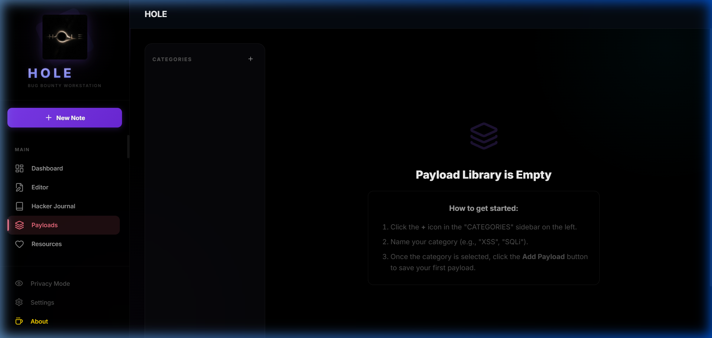
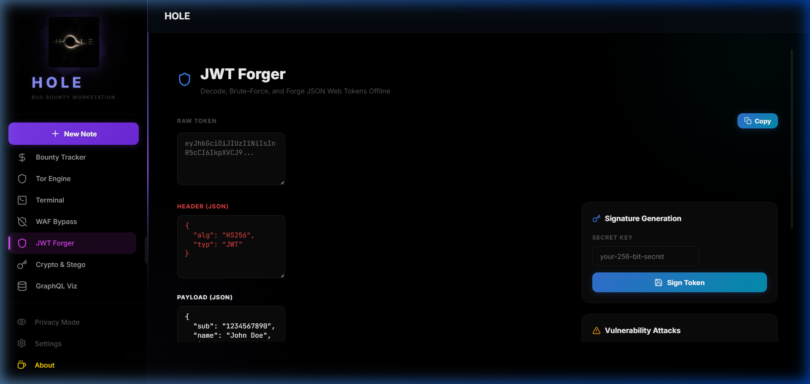
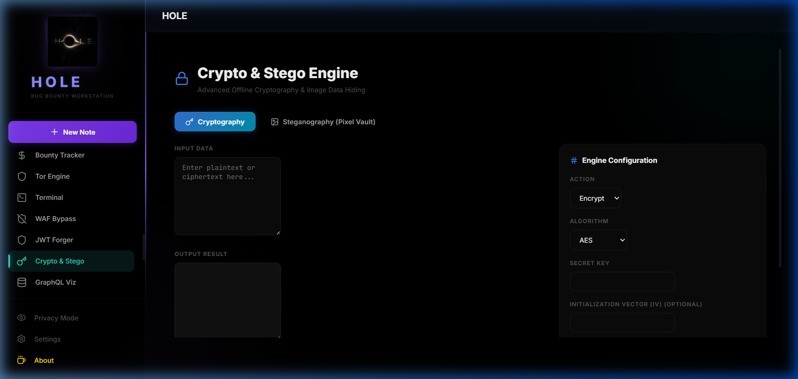
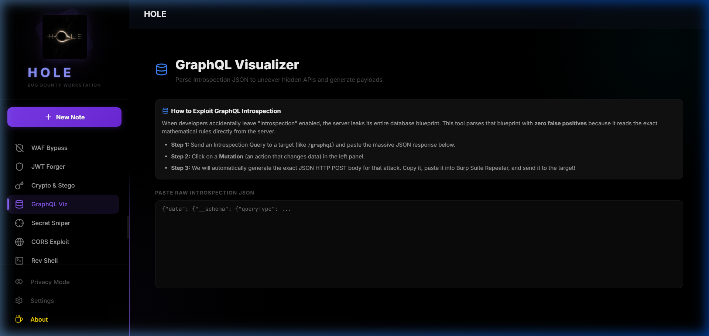
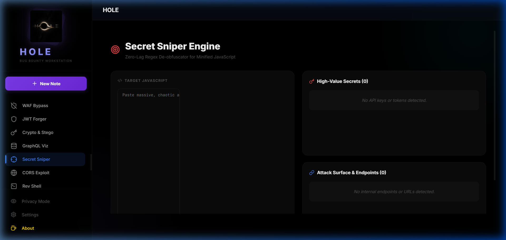
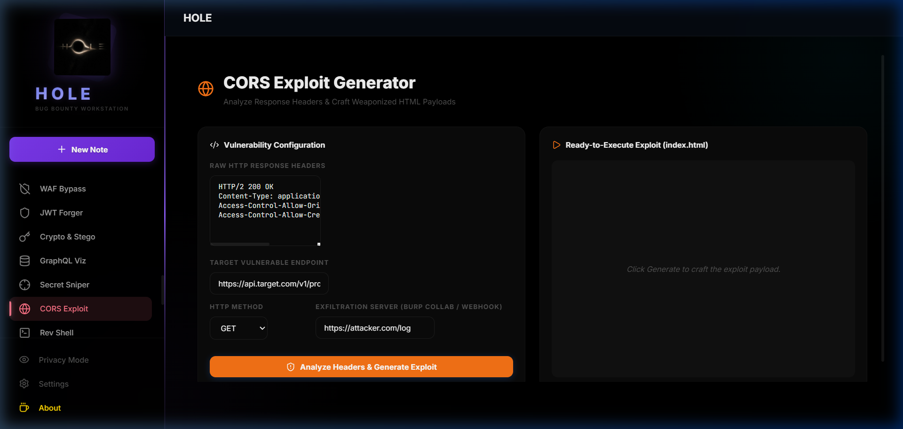
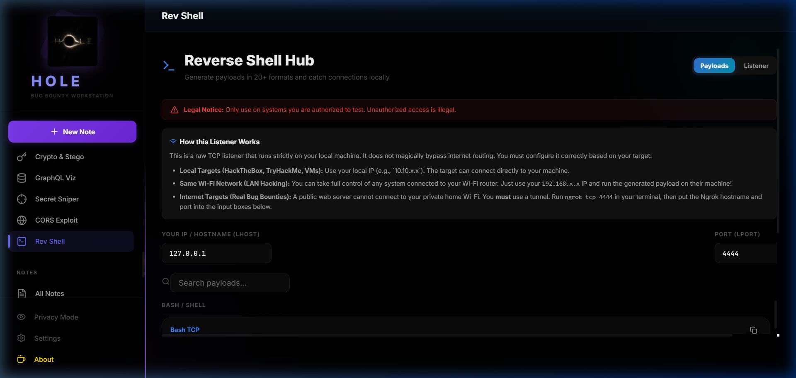
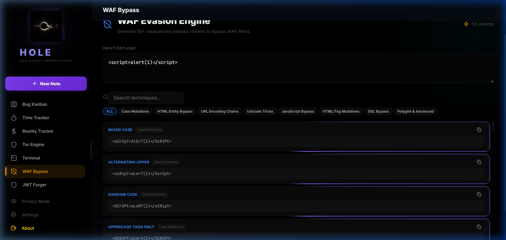

<p align="center">
  
</p>

<h1 align="center">H O L E</h1>
<p align="center">
  <strong>The Anonymous Bug Bounty Workstation</strong>
</p>

<p align="center">
  
  
  
  
</p>

<p align="center">
  <em>A fully offline, native desktop workstation built for elite bug bounty hunters.</em><br/>
  <em>Zero telemetry. Zero cloud. Everything runs on YOUR machine.</em>
</p>

---

<p align="center">
  
</p>

---

## Why HOLE?

Most security tools are either web-based SaaS products that phone home, or scattered CLI utilities with no unified workflow. **HOLE** is different.

It is a single, self-contained Electron application that combines **20+ professional security tools** into one dark-themed, keyboard-driven workstation. Every operation — from JWT cracking to image steganography — happens 100% offline on your local machine with zero network requests.

**No accounts. No subscriptions. No data leaves your computer. Ever.**

---

## Features

### Intelligence & Recon
| Tool | Description |
|------|-------------|
| **Recon Workspace** | Organize targets, subdomains, and attack surface notes |
| **Recon Database** | Persistent local database for storing recon findings |
| **Platform Dashboard** | Track active programs across HackerOne, Bugcrowd, Intigriti |

### Offensive Tools
| Tool | Description |
|------|-------------|
| **Payload Library** | 500+ categorized XSS, SQLi, SSRF, and SSTI payloads with one-click copy |
| **WAF Bypass Engine** | Generate WAF evasion payloads for Cloudflare, Akamai, AWS WAF, and more |
| **JWT Forger** | Decode, edit, re-sign, and brute-force JWT tokens offline |
| **Reverse Shell Generator** | Generate reverse shells in 15+ languages (Python, Bash, PowerShell, PHP, etc.) |
| **CORS Exploit Generator** | Paste HTTP response headers → get a ready-to-use HTML exploit file |
| **GraphQL Visualizer** | Parse introspection JSON → interactive tree of all queries, mutations, and types |
| **Secret Sniper** | Paste massive minified JS → instantly extract API keys, endpoints, and secrets |

### Cryptography & Steganography
| Tool | Description |
|------|-------------|
| **Crypto Engine** | AES / DES / TripleDES / RC4 encryption with CBC, ECB, CTR modes |
| **Pixel Vault (Steganography)** | Hide and extract secret messages inside PNG images using LSB encoding |

### Utilities
| Tool | Description |
|------|-------------|
| **Encoder / Decoder** | Base64, URL, HTML, Hex, Binary, ROT13 — encode and decode anything |
| **String Analyzer** | Hash generation (MD5, SHA-1, SHA-256, SHA-512), character analysis |
| **CVSS Calculator** | Calculate vulnerability severity scores with the CVSS v3.1 standard |
| **Identity Generator** | Generate fake identities for account testing |
| **DiffScope** | Compare two code blocks side-by-side to spot changes |

### Productivity
| Tool | Description |
|------|-------------|
| **Rich Note Editor** | Full WYSIWYG editor with tables, code blocks, images, and markdown |
| **Hacker Journal** | Daily encrypted journal for documenting your hunting sessions |
| **Kanban Board** | Visual task tracker for managing targets and methodologies |
| **Time Tracker** | Track hours spent per target for professional invoicing |
| **Methodology Tracker** | Step-by-step checklists for OWASP, API, and mobile testing |
| **Code Editor** | Built-in Monaco editor (same engine as VS Code) with syntax highlighting |
| **Screenshot Annotator** | Capture and annotate screenshots for bug reports |

---

## Screenshots

<details>
<summary><strong>Click to expand all screenshots</strong></summary>

### Payload Library


### JWT Forger


### Crypto & Steganography Engine


### GraphQL Visualizer


### Secret Sniper (JS Regex Engine)


### CORS Exploit Generator


### Reverse Shell Generator


### WAF Bypass Engine


</details>

---

## Installation

### Prerequisites

- [Node.js](https://nodejs.org/) v18+ (LTS recommended)
- [Git](https://git-scm.com/)

### Quick Start (All Platforms)

```bash
# Clone the repository
git clone https://github.com/H-A-R-S-H-V-A-R-D-H-A-N/HOLE.git
cd HOLE

# Install dependencies
npm install

# Start the desktop app
npm run electron:dev
```

### Windows

```powershell
# Option 1: Use the install script
.\install.bat

# Option 2: Manual
git clone https://github.com/H-A-R-S-H-V-A-R-D-H-A-N/HOLE.git
cd HOLE
npm install
npm run electron:dev
```

### Linux / macOS

```bash
# Option 1: Use the install script
chmod +x install.sh
./install.sh

# Option 2: Manual
git clone https://github.com/H-A-R-S-H-V-A-R-D-H-A-N/HOLE.git
cd HOLE
npm install
npm run electron:dev
```

### Build Native Installer

```bash
# Windows (.exe installer)
npm run electron:build

# Linux (.AppImage)
npm run electron:build

# macOS (.dmg)
npm run electron:build
```

The installer will be created in the `release/` directory.

---

## Architecture

```
hole/
├── electron/          # Electron main process (native OS access)
│   └── main.cjs       # Window management, IPC, file system APIs
├── src/
│   ├── components/    # 39 React components (one per tool)
│   ├── styles/        # CSS modules for each component
│   ├── utils/         # File system helpers, storage abstraction
│   ├── App.jsx        # Main router and layout
│   └── main.jsx       # React entry point
├── public/            # Static assets (icons, logos)
└── package.json       # Dependencies and build config
```

### Tech Stack

| Layer | Technology |
|-------|-----------|
| **Runtime** | Electron v42 |
| **Frontend** | React 19 + Vite 8 |
| **Editor** | TipTap (rich text) + Monaco (code) |
| **Crypto** | crypto-js (AES, DES, TripleDES, RC4) |
| **Terminal** | xterm.js + node-pty |
| **Icons** | Lucide React |
| **Canvas** | Fabric.js (annotations) |

---

## Security & Privacy

- **Zero telemetry** — No analytics, no tracking, no phone-home behavior
- **Zero cloud** — All data stored locally on your filesystem
- **Zero network** — Every tool operates 100% offline (except the optional Tor browser)
- **Local storage only** — Notes, journals, and findings are saved as plain files you fully control
- **Open source** — Audit every line of code yourself

---

## Keyboard Shortcuts

| Shortcut | Action |
|----------|--------|
| `Ctrl + N` | New Note |
| `Ctrl + S` | Save Current Note |
| `Ctrl + Shift + P` | Toggle Privacy Mode |

---

## Contributing

Contributions are welcome! Please open an issue first to discuss what you would like to change.

1. Fork the repository
2. Create your feature branch (`git checkout -b feature/new-tool`)
3. Commit your changes (`git commit -m 'Add new tool'`)
4. Push to the branch (`git push origin feature/new-tool`)
5. Open a Pull Request

---

## License

This project is licensed under the MIT License. See the [LICENSE](LICENSE) file for details.

---

## Disclaimer

**HOLE** is designed for authorized security testing and educational purposes only. The developers are not responsible for any misuse. Always obtain proper authorization before testing any system you do not own.

---

<p align="center">
  
  <br/>
  <strong>Built by hackers, for hackers.</strong><br/>
  <a href="https://github.com/H-A-R-S-H-V-A-R-D-H-A-N/HOLE">★ Star the repo on GitHub!</a>
</p>
