<div align="center">
  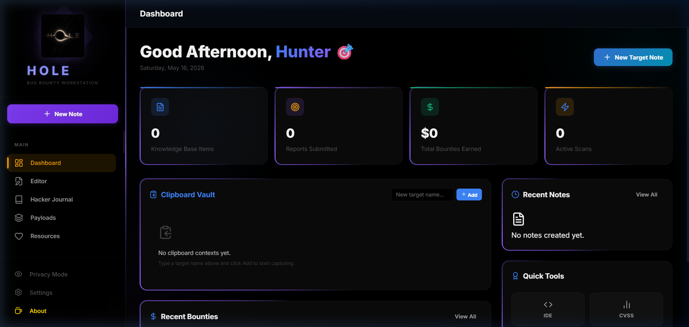
  <h1>H O L E</h1>
  <p><strong>The Anonymous Bug Bounty Workstation</strong></p>
  <p>A fully offline, native desktop arsenal built for elite penetration testers and bug bounty hunters.<br/>39 integrated security tools. Zero telemetry. Complete local data sovereignty.</p>

  <br/>

  
  
  
  

  <br/><br/>

  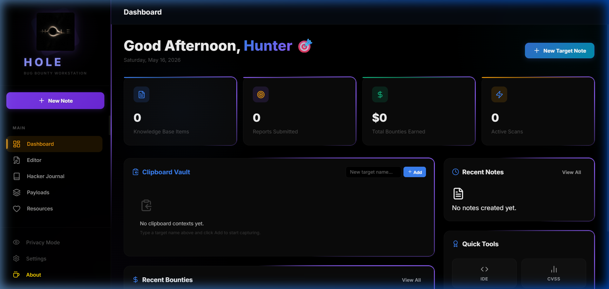
</div>

<br/>

---

<br/>

## Why HOLE Exists

Every serious hunter knows the pain. You have 15 terminal tabs open, five browser extensions fighting each other, scattered notes across three apps, and your recon data lives in random folders you will never find again.

HOLE kills that workflow chaos. It is a single native Electron application that replaces your entire fragmented toolkit with one unified dark-themed interface. Everything from subdomain mapping to JWT forgery to reverse shell generation happens inside one window, and nothing ever touches the internet unless you explicitly route it through the built-in Tor engine.

Your data stays on your hard drive. Period.

<br/>

---

<br/>

## HOLE PRO - The Ultimate Security Arsenal

For elite security researchers, penetration testers, and bug bounty hunters who demand the absolute best tools available, **HOLE PRO** offers a fully-unlocked, premium suite of advanced exploitation and analysis modules. 

### Advanced Modules Included in PRO:
- **CVE Mapper:** Instantly map emerging CVEs directly to your defined attack surface and targets.
- **Advanced IP Tracker:** Deep geolocation intelligence, ASN mapping, and integrated port scanning.
- **Email Header Analyzer:** Trace email routes, extract sender IPs, and verify SPF/DKIM/DMARC authentication.
- **Infrastructure Harvester:** Harvest emails, subdomains, URLs, social profiles, and detect subdomain takeovers automatically.
- **Cloud Bucket Finder:** Discover exposed S3 buckets, Azure blobs, and GCP storage with zero false positives.
- **Favicon Hunter:** Identify technologies and discover hidden infrastructure via favicon fingerprinting.
- **Exposure Hunter:** Scan target domains for leaked source code, secrets, database dumps, and sensitive configuration files.
- **WAF Detector & Bypasser:** Fingerprint 30+ Web Application Firewalls, test attack payloads, and discover bypass techniques.
- **Auto-Exploit Integrations:** Connect directly with your favorite external exploitation scripts and binaries.
- **Direct Developer Support:** If you encounter any bugs, setup issues, or need help with a target, you get direct, priority 1-on-1 support from the creator.

> 💡 **PRO TIP: Not all Dangling CNAMEs are Exploitable!**
> Tools like the HOLE PRO Infrastructure Harvester are excellent at finding dangling CNAMEs. However, remember the golden rule of takeovers: just because it points to `elb.amazonaws.com` or `*.github.io` doesn't mean you can claim it! AWS ELB hostnames are randomly generated, and GitHub requires root domain verification for `*.github.com`. Always attempt to place a benign `hacker.html` file on the endpoint to prove exploitation before submitting your bounty report to avoid N/A resolutions!

### Unrestricted Lifetime License
We reject the subscription model. HOLE PRO is available as a single, one-time purchase. You own the software and all future updates forever.

**Special Launch Offer:** We are currently offering a 50% discount for the first 50 professional users.

**How to Upgrade:**
To purchase your lifetime license and receive the fully compiled, secure desktop package for your operating system, please contact the lead developer directly:
**harshvardhansinghrathore611@gmail.com**

*Please note: More premium features are constantly in development and will be rolled out exclusively to PRO users.*

### PRO Interface Previews

<div align="center">
  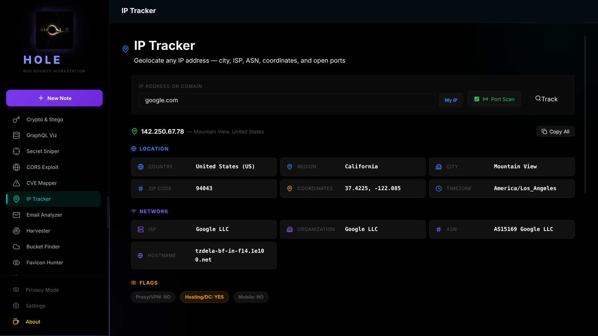
  <br/><br/>
  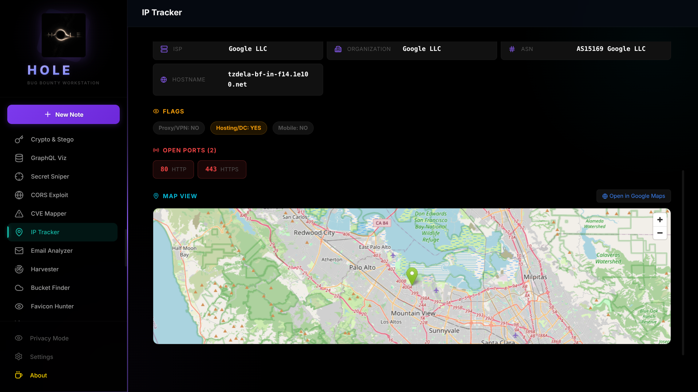
  <br/><br/>
  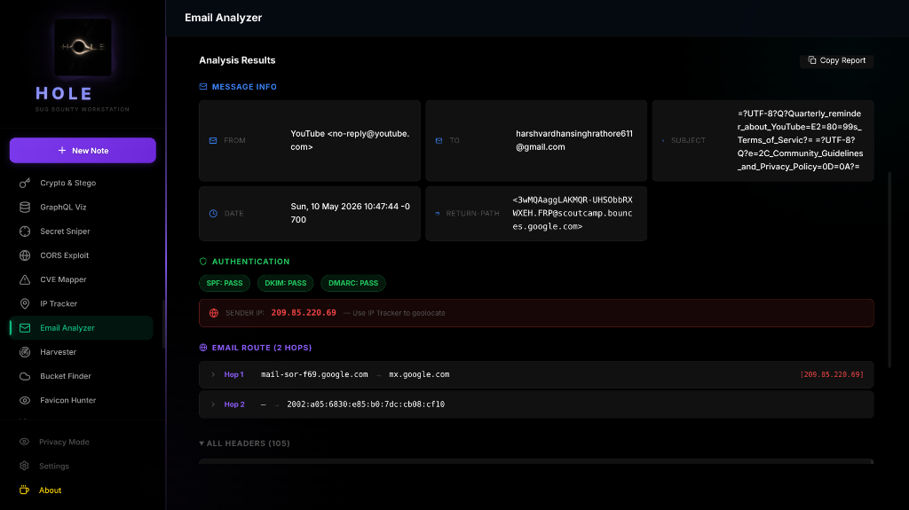
  <br/><br/>
  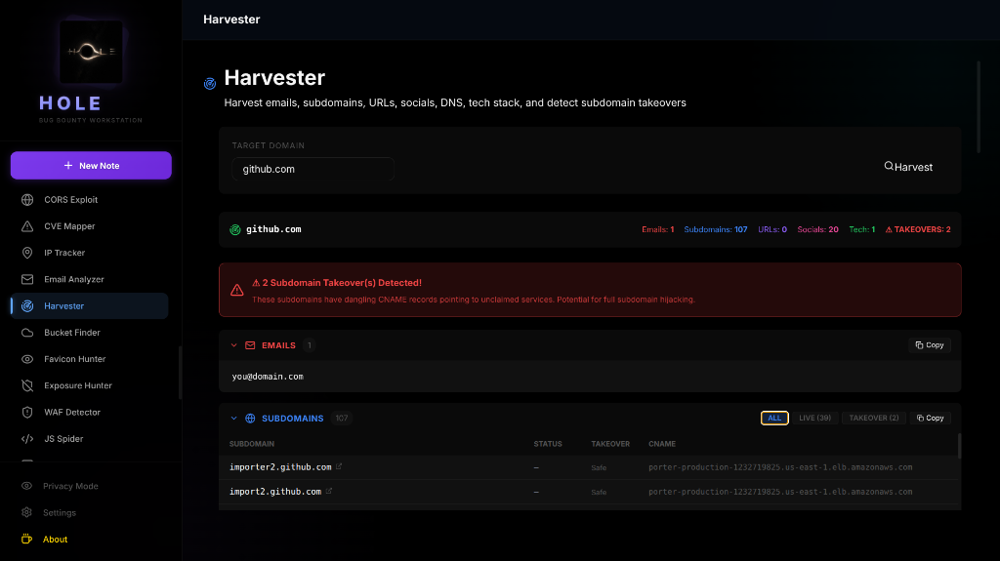
  <br/><br/>
  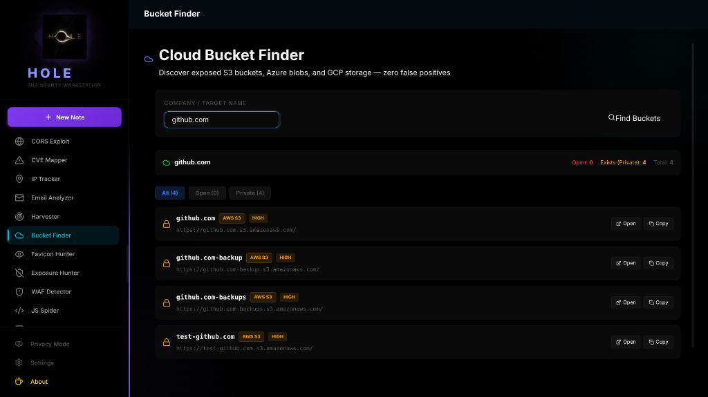
  <br/><br/>
  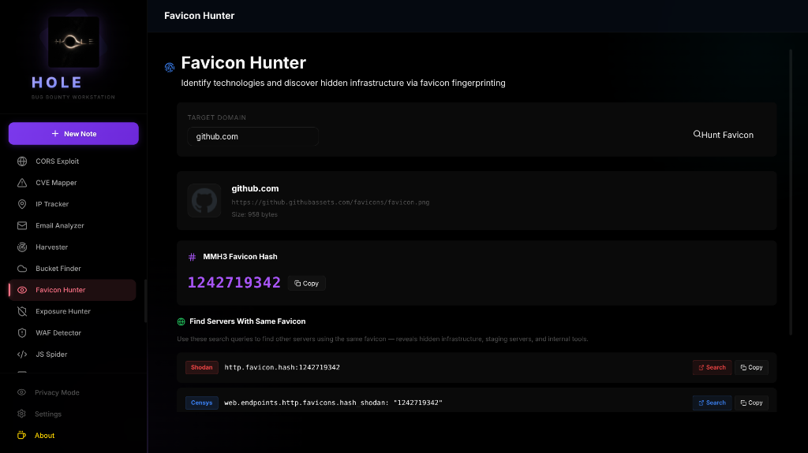
  <br/><br/>
  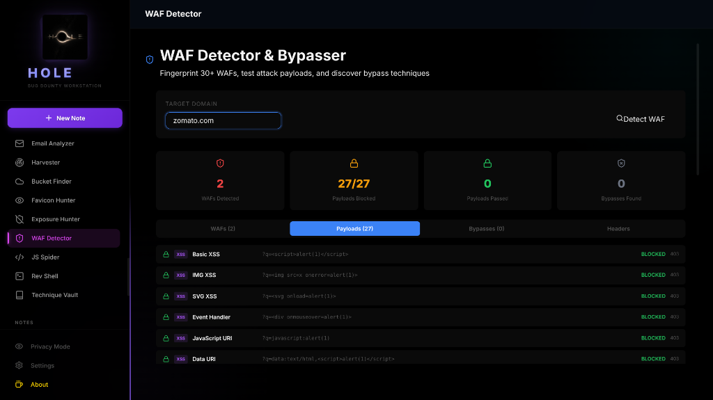
  <br/><br/>
  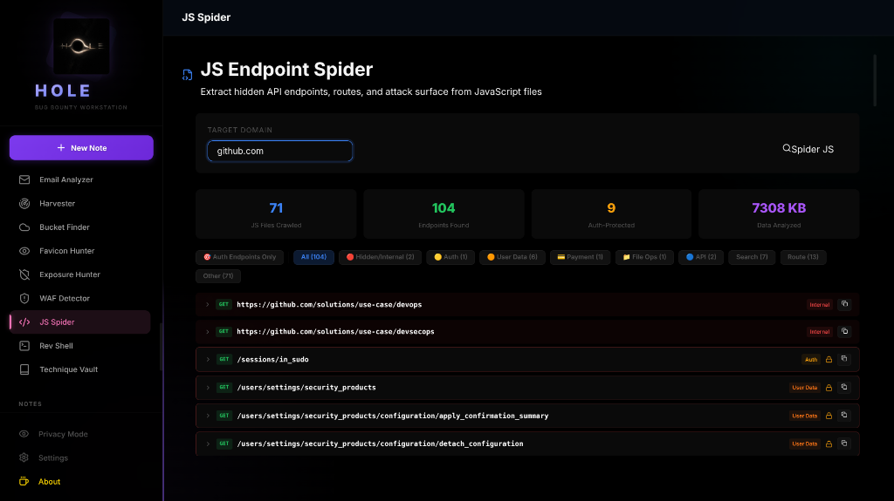
  <br/><br/>
  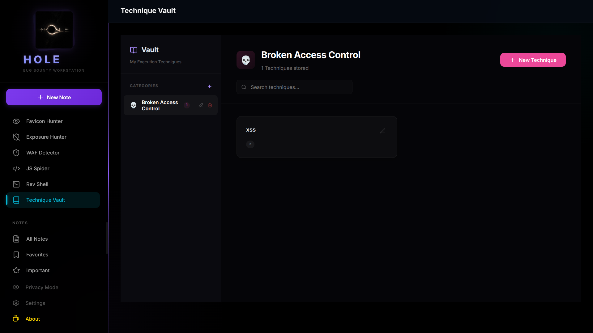
  <br/><br/>
  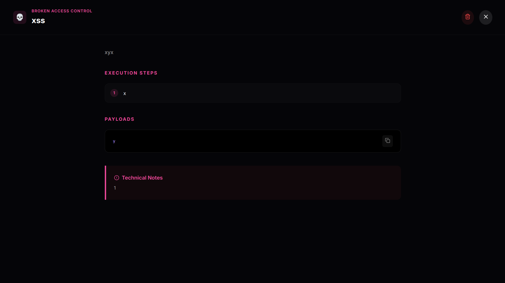
</div>

<br/>

---

<br/>

## Tor Engine and Ghost Mode

A native Tor daemon controller embedded directly into the workstation. Start, stop, and manage Tor circuits without ever opening a terminal. Force your entire operating system through the Tor network with a single button.

<div align="center">
  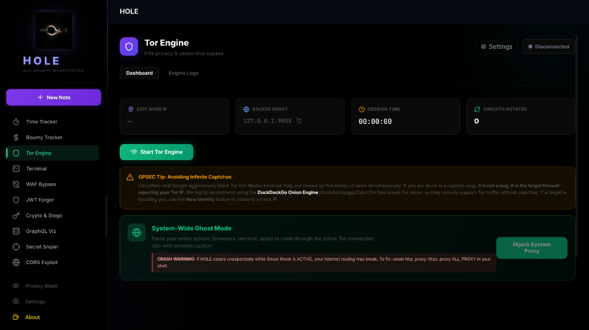
</div>

<br/>

**What it does:**
- Spawns and manages a local Tor SOCKS5 proxy on `127.0.0.1:9050`
- Rotates exit node circuits on demand or on a timer (every 5, 10, or 30 minutes)
- Displays your current exit node IP in real time
- **System-Wide Ghost Mode** hijacks your OS proxy settings to force ALL system traffic (browsers, terminals, background apps) through the active Tor connection
- Native support for `obfs4` and `snowflake` bridges to bypass ISP-level censorship
- Country-specific exit node selection (US, UK, DE, RU, and more)
- Kill-switch protection: if the Tor daemon crashes, all connections drop immediately to prevent IP leaks

<br/>

---

<br/>

## Visual Workflow Builder (Recon Database)

An n8n-style drag-and-drop node editor for mapping out attack surfaces visually. Stop reading massive JSON blobs and start connecting subdomains, endpoints, and services into interactive maps that actually make sense.

<div align="center">
  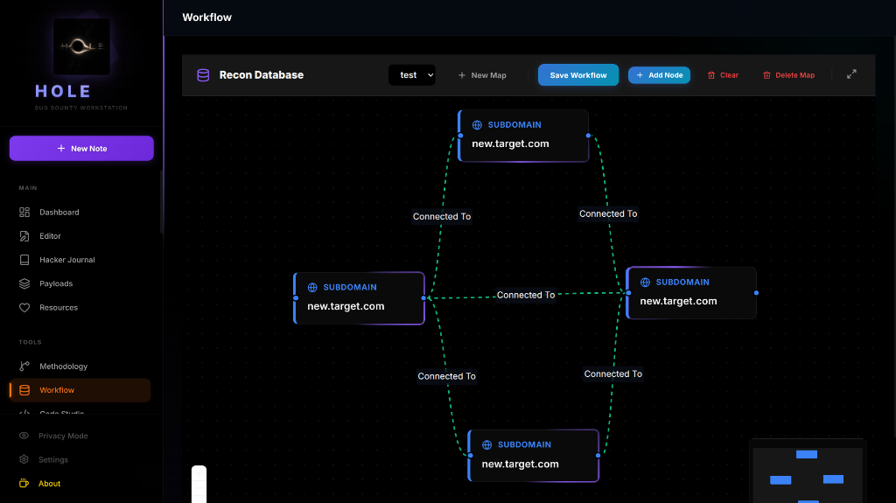
</div>

<br/>

**What it does:**
- Create unlimited workflow maps per target
- Add typed nodes (Subdomain, Endpoint, Service, Custom) and connect them with labeled edges
- Drag, resize, and rearrange nodes freely on an infinite canvas
- Save and load workflow databases locally
- GraphQL schema introspection: paste a schema and auto-generate a full node map of all queries and mutations

<br/>

---

<br/>

## Hacker Journal

A calendar-based daily logging system. Pick any date, type what you tested, and it saves. No accounts, no sync, no nonsense. Plain markdown files on your disk.

<div align="center">
  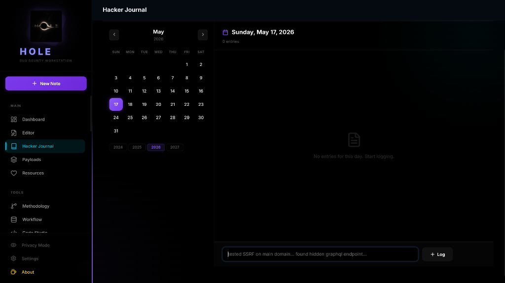
</div>

<br/>

---

<br/>

## Code Studio PRO

A full IDE with Monaco Editor (the same engine behind VS Code) built directly into the workstation. Create repositories, folders, and files that save directly to your configured HOLE workspace on disk.

<div align="center">
  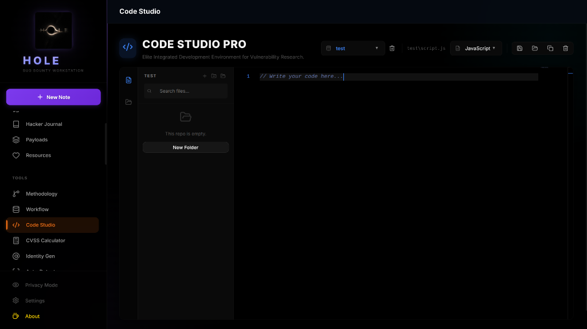
</div>

<br/>

**What it does:**
- 25+ language modes with full syntax highlighting (Python, Go, Rust, JavaScript, SQL, Bash, and more)
- Create repos, folders, and files directly inside the app — all saved to your local HOLE workspace
- File tree explorer with search, drag, and delete
- Import files from anywhere on your PC
- Auto-detect language from file extension

<br/>

---

<br/>

## Integrated Terminal

A native xterm.js terminal embedded in the UI. Run any shell command without tabbing out. Supports Bash, Zsh, Fish, and PowerShell with full ANSI color rendering.

<div align="center">
  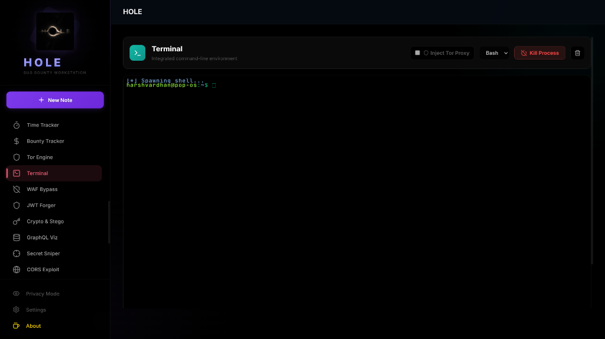
</div>

<br/>

**What it does:**
- Full PTY (pseudo-terminal) support via `node-pty`
- Inject Tor proxy into the terminal environment with one checkbox
- Select between available shells (Bash, Zsh, Fish, PowerShell)
- Kill running processes instantly

<br/>

---

<br/>

## Reverse Shell Hub

Generate reverse shell payloads in 20+ formats and catch incoming connections with a built-in raw TCP listener. Everything runs locally on your machine.

<div align="center">
  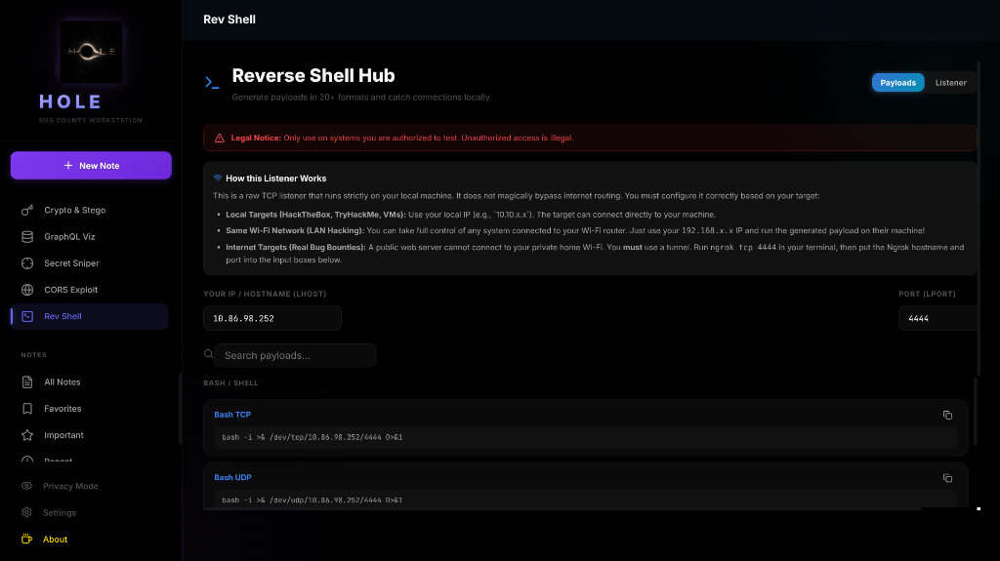
  <br/><br/>
  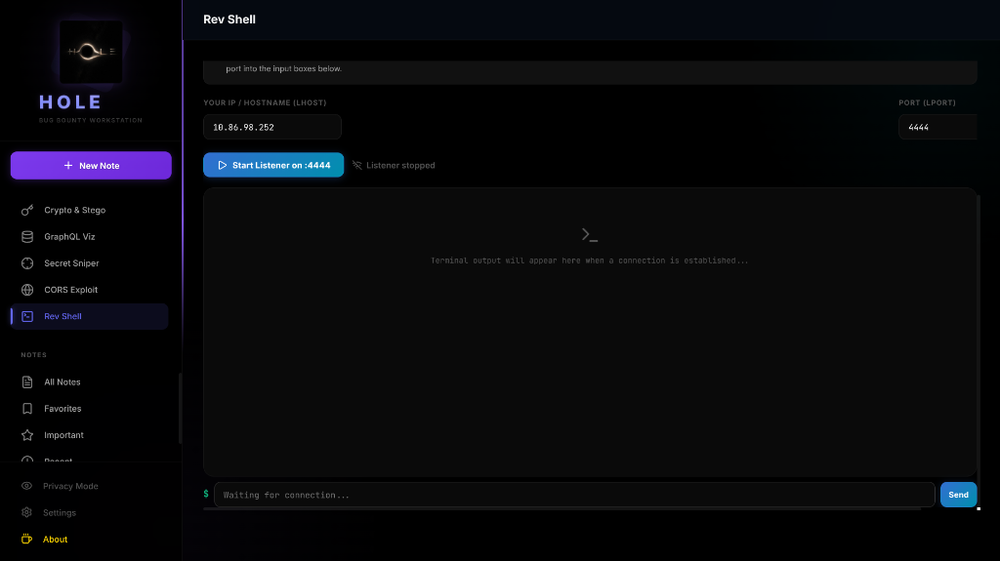
</div>

<br/>

**What it does:**
- Auto-detects your local IP address
- Generates payloads for Bash, Python, PHP, Ruby, Perl, PowerShell, Netcat, Socat, and more
- Built-in TCP listener that catches connections and provides an interactive shell
- One-click copy for any generated payload
- Works on local targets (HackTheBox, TryHackMe), LAN, and internet targets via Ngrok tunneling

<br/>

---

<br/>

## JWT Forger

Decode, modify, re-sign, and brute-force JSON Web Tokens entirely offline.

<div align="center">
  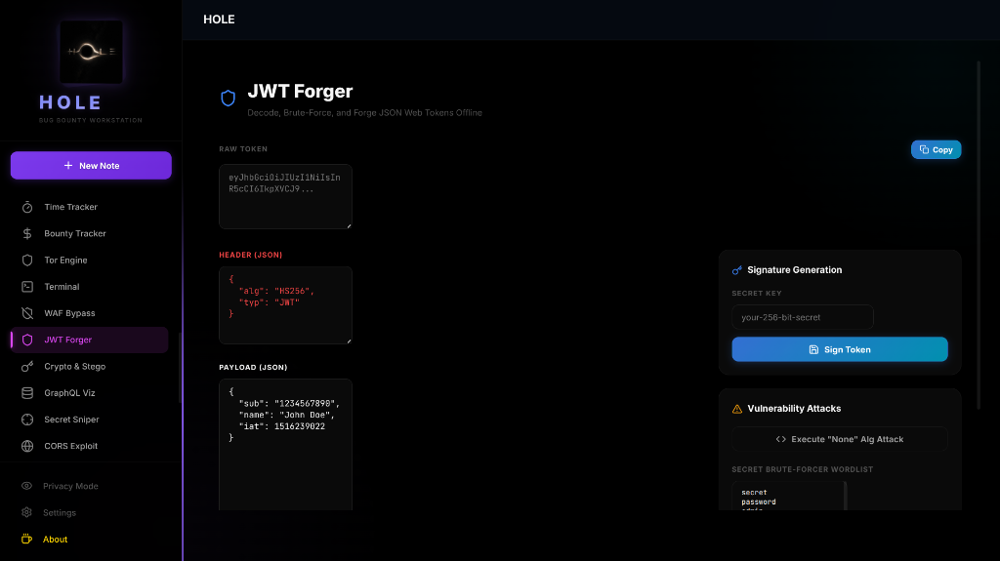
</div>

<br/>

**What it does:**
- Paste any JWT and instantly decode the Header, Payload, and Signature
- Modify claims and re-sign with a custom secret key
- Execute the `alg: none` attack with one click
- Built-in secret brute-forcer with a customizable wordlist

<br/>

---

<br/>

## CORS Exploit Generator

Paste raw HTTP response headers and instantly generate a weaponized `index.html` exploit payload ready for proof-of-concept submissions.

<div align="center">
  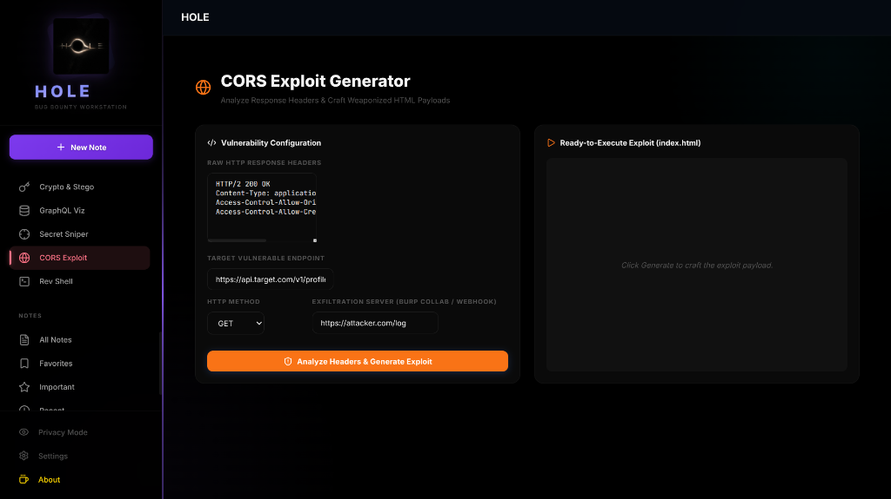
</div>

<br/>

**What it does:**
- Analyzes `Access-Control-Allow-Origin` and `Access-Control-Allow-Credentials` headers
- Generates ready-to-execute HTML/JS exploit code
- Supports GET, POST, PUT, DELETE methods
- Configurable exfiltration server (Burp Collaborator / webhook endpoint)

<br/>

---

<br/>

## Secret Sniper Engine

Paste massive, chaotic, minified JavaScript bundles and instantly extract every API key, token, endpoint, and secret hiding inside.

<div align="center">
  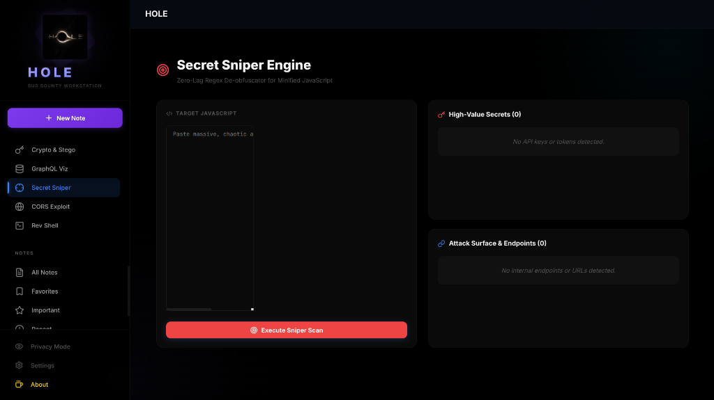
</div>

<br/>

**What it does:**
- Zero-lag regex de-obfuscator purpose-built for minified JavaScript
- Detects AWS keys, Google API keys, Stripe tokens, JWTs, Bearer tokens, and dozens more
- Extracts internal API endpoints and URLs automatically
- Fully offline pattern matching, no external API calls

<br/>

---

<br/>

## Encoder / Decoder (50+ Formats)

Transform payloads between 50+ encoding formats instantly. Base64, URL, Hex, HTML Entity, Binary, Octal, ROT13, Morse Code, Caesar Shift, and dozens more. Essential for WAF bypass and payload obfuscation.

<div align="center">
  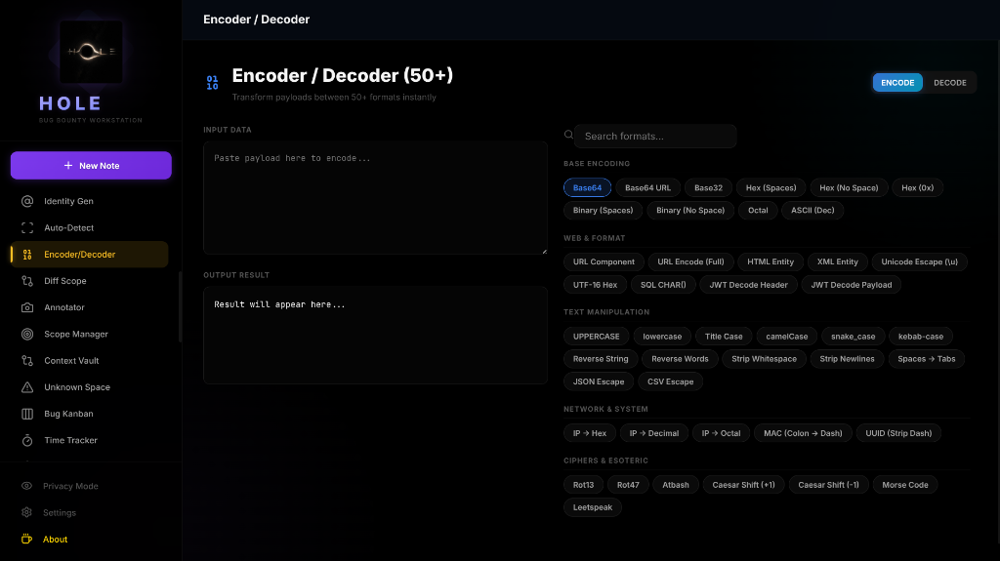
</div>

<br/>

---

<br/>

## Auto-Detect (50+ Rules)

Paste any unknown string and HOLE will automatically identify what it is. Supports 50+ definitions including hashes (MD5, SHA1, SHA256), cloud keys (AWS, GCP, Slack, Stripe, SendGrid), crypto addresses, PII patterns, and encoded data.

<div align="center">
  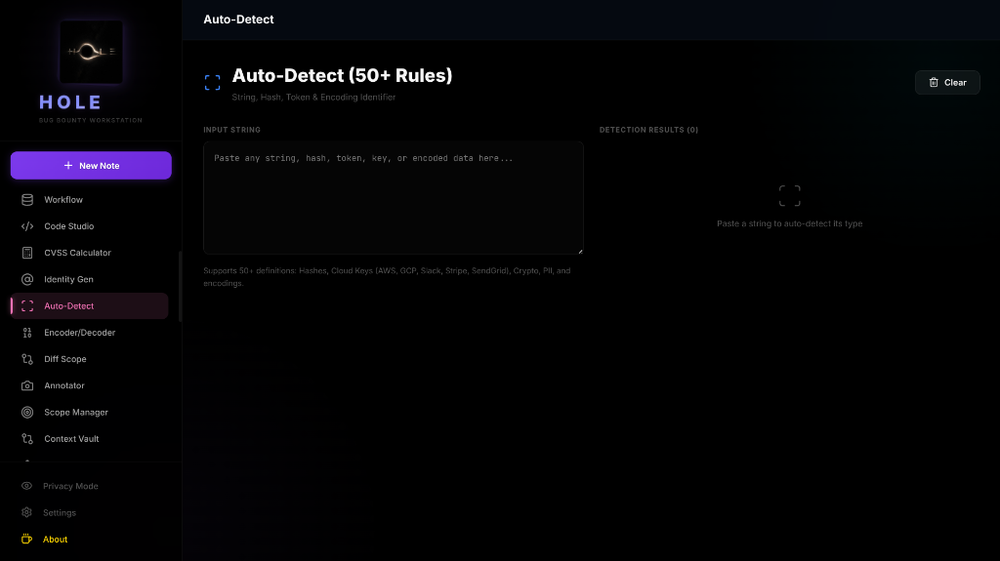
</div>

<br/>

---

<br/>

## Crypto and Stego Engine

A dual-mode cryptography and steganography workbench. Encrypt and decrypt data with military-grade algorithms, or hide secret messages inside images using LSB pixel manipulation.

<div align="center">
  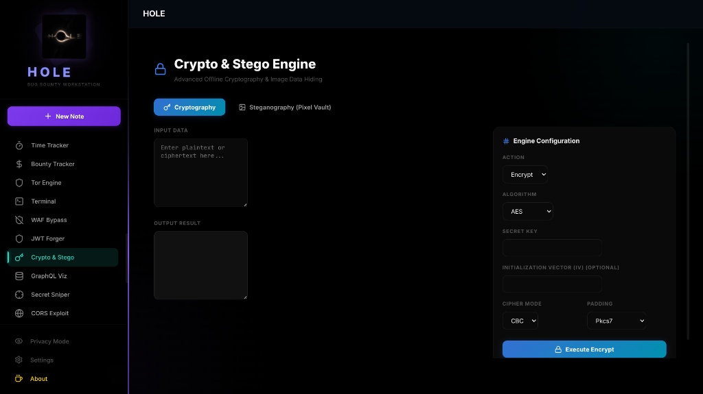
  <br/><br/>
  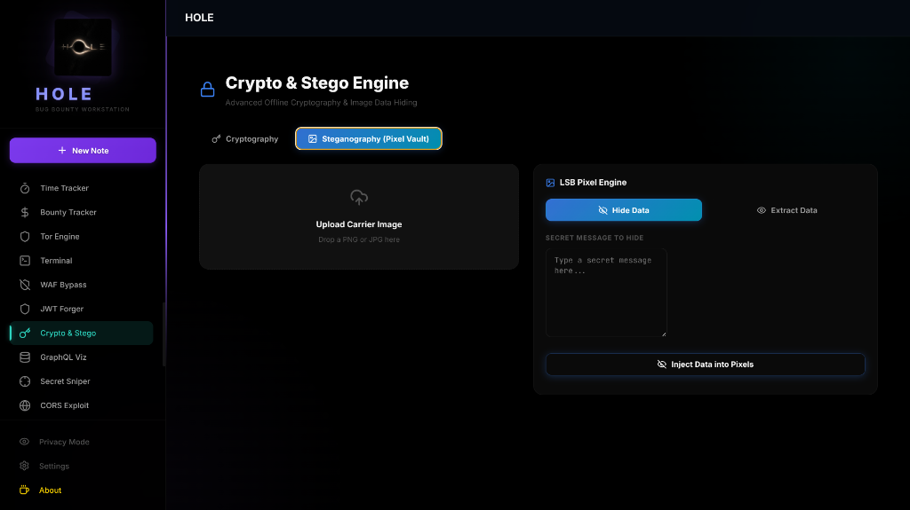
</div>

<br/>

**Cryptography:**
- AES, DES, TripleDES, and Rabbit encryption/decryption
- CBC, ECB cipher modes with PKCS7 padding
- Custom key and IV input

**Steganography (Pixel Vault):**
- Hide encrypted text payloads inside PNG and JPG images using LSB encoding
- Extract hidden data from stego images
- Completely invisible to the naked eye

<br/>

---

<br/>

## Diff Scope

Character-level comparison tool for spotting differences between two inputs. Useful for comparing server responses, modified payloads, or configuration changes.

<div align="center">
  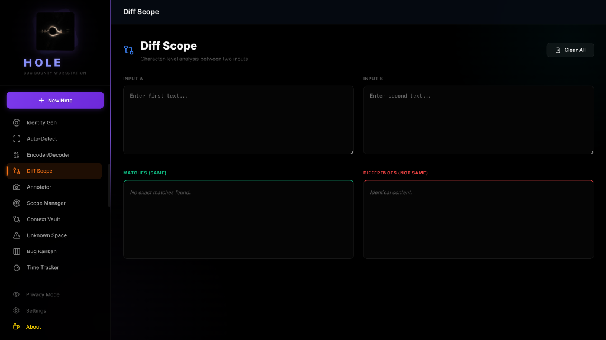
</div>

<br/>

---

<br/>

## Time Tracker

A focused session timer for tracking exactly how many hours you spend on each bug bounty target. Logs directly to your Hacker Journal.

<div align="center">
  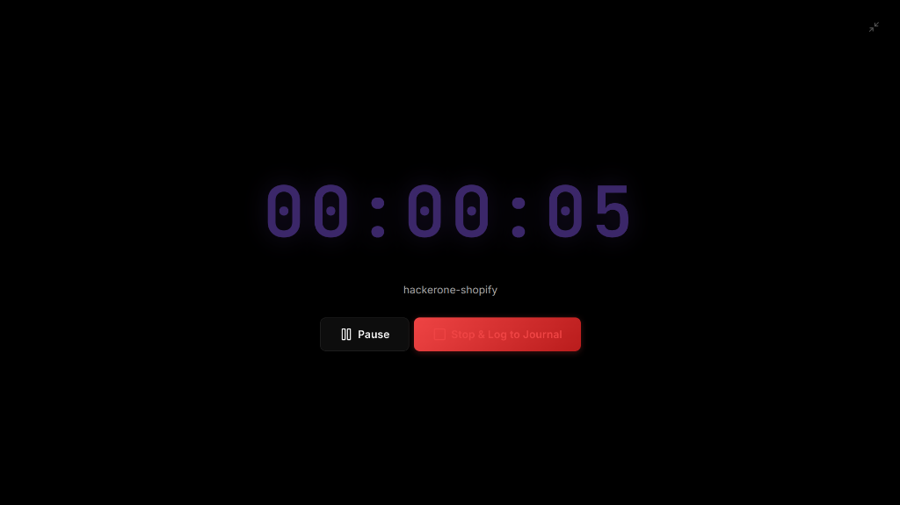
</div>

<br/>

---

<br/>

## Full Tool List

Beyond the tools shown above, HOLE includes the following integrated modules:

| Category | Tools |
|---|---|
| **Recon** | Subdomain Mapper, Scope Manager, Bounty Tracker (Kanban), Methodology Checklists |
| **Analysis** | WAF Bypass Engine, String Analyzer/Obfuscator, Encoder/Decoder, Auto-Detect |
| **Exploitation** | Payload Library (XSS, SQLi, SSRF, LFI, RCE), HTTP Request Smuggling |
| **Identity** | Identity Generator for anonymous testing profiles |
| **Notes** | Rich Text Editor (Tiptap), All Notes, Favorites, Important, Recent |
| **Data** | Context Vault, Unknown Space, Clipboard Vault, Knowledge Base |
| **Visualization** | GraphQL Viz, Workflow Maps, Annotator |

<br/>

---

<br/>

## Installation

HOLE runs natively from source. No pre-built binaries, no hidden code. You can read every single line before you execute it.

### Prerequisites

- **Node.js** v20 or higher (v22 LTS recommended)
- **Git**
- **Build tools** for native modules (`build-essential` on Debian/Ubuntu, Xcode CLT on macOS)

### Linux

```bash
git clone https://github.com/H-A-R-S-H-V-A-R-D-H-A-N/HOLE.git
cd HOLE
bash install.sh
npm run electron:dev
```

The installer automatically detects your distro (Ubuntu, Debian, Arch, Fedora) and installs Tor if it is not already present.

### macOS

```bash
git clone https://github.com/H-A-R-S-H-V-A-R-D-H-A-N/HOLE.git
cd HOLE
bash install.sh
npm run electron:dev
```

The installer uses Homebrew to install Tor if needed.

### Windows

```cmd
git clone https://github.com/H-A-R-S-H-V-A-R-D-H-A-N/HOLE.git
cd HOLE
install.bat
npm run electron:dev
```

The installer checks for Tor and attempts to download the Tor Expert Bundle if it is missing.

<br/>

---

<br/>

## Updating. (MAKE SURE YOU UPDATE THIS REPO FOR THE LATEST FIX IN THE CODE ALWAYS CHECK  THE NEW UPDATE ON THE REPO )

```bash
cd HOLE
git pull origin main
npm install
npm run electron:dev
```

<br/>

---

<br/>

## Security Architecture

| Principle | Implementation |
|---|---|
| **Zero Analytics** | No tracking scripts, no crash reporters, no telemetry of any kind |
| **Offline First** | The application makes zero network requests unless explicitly routed through the Tor engine |
| **Local Storage** | All data (notes, workflows, payloads, journals) is saved as plain files in your `HOLE_Workspace` directory |
| **No Database** | No SQLite, no MongoDB, no remote DB. Everything is flat files you can read, move, and delete |
| **Open Source** | Every line of code is visible in this repository |

<br/>

---

<br/>

## Disclaimer

HOLE is built for authorized security testing, bug bounty programs (HackerOne, Bugcrowd, Intigriti), and educational purposes. The developers assume no liability for misuse. Always obtain explicit written authorization before testing systems you do not own.

<br/>

<div align="center">
  <sub>Built by hunters, for hunters.</sub>
</div>
